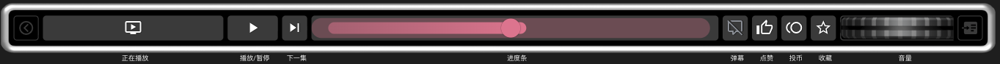

# BilibiliPlugin — FlexBar 哔哩哔哩控制插件 (macOS)

在 FlexBar 上显示哔哩哔哩**正在播放**的视频（封面 / 标题 / UP主 / 进度），并直接控制
**进度条拖拽、播放/暂停、下一集、快进快退、音量、弹幕、点赞/投币/收藏**。

<p align="center">
  
</p>

<p align="center">
  
</p>

<p align="center"><sub>正在播放 · 播放/暂停 · 下一集 · 进度条 · 弹幕 · 点赞 · 投币 · 收藏 · 音量</sub></p>

## 工作原理

哔哩哔哩 Mac 客户端（`/Applications/哔哩哔哩.app`，bundle `com.bilibili.bilibiliPC`）是一个
**Electron 应用**。用 `--remote-debugging-port` 启动后，它会暴露 Chrome DevTools Protocol(CDP)，
其中 `player.html` 页面承载真正的 `<video>` 元素。

本插件是**自包含**的：插件后端（FlexDesigner 的 Node 子进程）**直接**通过 CDP 读取并驱动
该 `<video>`，**不需要任何独立的后台服务**。

```
FlexBar 插件后端 (backend/plugin.cjs，跑在 FlexDesigner 里)
     │  CDP：读取/驱动 player.html 里的 <video>
     ▼
哔哩哔哩.app (Electron, --remote-debugging-port=9222)
```

- **进度条拖拽** = 设置 `video.currentTime`（逐帧精确）
- **播放 / 暂停** = `video.play()` / `video.pause()`（读真实状态）
- **下一集** = 点击播放器「下一P」按钮
- **快进 / 快退** = `video.currentTime ± 15s`
- **音量** = 设置 `video.volume`（播放器内音量，非系统音量）
- **弹幕 / 点赞 / 投币 / 收藏** = 点击播放器里对应按钮
- **标题 / UP主 / 封面** = 按 `bvid` 调哔哩哔哩 `view` 接口获取（稳定、含封面）

> 插件**不修改 FlexDesigner 任何东西**——它只是后端 Node 进程在用 `child_process`（拉起 App）
> 和 `ws`（连 App 的调试端口）做事，这是 SDK 对后端的标准定位。被驱动的是哔哩哔哩，不是 FlexDesigner。

## 功能

| 功能 | 状态 |
| --- | --- |
| 视频标题 / UP主 / 封面 / 进度显示 | ✅ |
| 进度条**拖拽跳转**（slider 按键） | ✅ 逐帧精确 |
| 播放 / 暂停（multiState 按键） | ✅ 真实状态同步 |
| 下一集（多P / 分集） | ✅ 点击播放器按钮，单P视频可能无动作 |
| 快进 / 快退 15 秒 | ✅ |
| 进度旋钮 / 音量旋钮（wheel 按键） | ✅ 音量为播放器内音量 |
| 弹幕显示 / 隐藏 | ✅ |
| 点赞 / 投币 / 收藏 | ✅ 状态高亮；投币/收藏按 B 站设置 |
| 触感反馈（haptic） | ✅ 离散操作时 |

## 环境要求

- macOS 11+（已在 Apple Silicon 实测）
- 已安装哔哩哔哩 Mac 客户端 `/Applications/哔哩哔哩.app`
- Node.js 18+
- FlexDesigner 1.0+ 与一台 FlexBar

> ⚠️ **Node 版本（仅影响热重载开发）**：`flexcli`（`npm run dev` 用到）目前用了旧的
> `import ... assert { type: 'json' }` 语法，**在 Node 23+ 会报错**。要用 `npm run dev` 请切到
> **Node 20 LTS**。而**安装(`plugin:copy`)、构建、插件运行本身在任意 Node 18+ 上都正常**——
> 见下方一键安装。

## 一键安装（新设备）⭐

新 Mac 上先装好 **哔哩哔哩客户端**、**FlexDesigner**（并至少打开过一次）、**Node 18+**，然后：

```bash
git clone https://github.com/H0ypothesis/bilibili-flexbar-plugin.git
cd bilibili-flexbar-plugin
bash scripts/setup.sh        # 装依赖 + 构建 + 安装进 FlexDesigner
```

跑完只剩两步：① **重启 FlexDesigner**，把按键从 Key Library 拖到 FlexBar；
② 打开哔哩哔哩播放视频——插件会**自动以调试端口拉起它**并接管控制。

> 若哔哩哔哩**已在运行但没开调试端口**，到插件配置页点一次「调试模式重启」即可。

## 开发 / 手动安装

```bash
npm install
npm run build                # 构建插件后端
npm run plugin:copy          # 安装进 FlexDesigner（任意 Node 版本）

# 想要改 src 自动重装的热重载开发——需 Node 20（flexcli 限制）
nvm use 20 && npm run dev
```

改完代码重装：`npm run build && npm run plugin:copy`，再重启 FlexDesigner。

## 按键说明

| 按键 | 类型 | 作用 |
| --- | --- | --- |
| 正在播放 | default | 封面 / 标题 / UP主 / 进度（可在配置里增减显示项）|
| 进度条 | **slider** | 拖动跳转到任意位置 |
| 播放/暂停 | **multiState** | 切换播放状态，图标随状态变化 |
| 下一集 | default | 下一P / 下一集（多P或分集）|
| 快退15秒 / 快进15秒 | default | 相对快退 / 快进 |
| 进度旋钮 | **wheel** | 旋转微调进度（每格约 2 秒）|
| 音量旋钮 | **wheel** | 旋转调节**视频内**音量（非系统音量）|
| 弹幕 | **multiState** | 显示 / 隐藏弹幕，开启时高亮 |
| 点赞 / 投币 / 收藏 | **multiState** | 对应操作，已生效时粉色高亮 |

> 点赞可直接切换；投币、收藏会按哔哩哔哩客户端的设置走——在 B 站里开启「投币后不再询问」即可一键投币。

## 配置页（FlexDesigner 内）

两步向导：
1. **以调试模式运行哔哩哔哩** —— 一键退出并带调试端口重启它（应对「已运行但没开端口」）。
2. **测试连接** —— 播放任意视频后点测试。

## 常见问题

- **一直「未在播放」/ 控制无效**
  - 确认哔哩哔哩以调试端口启动：`curl http://127.0.0.1:9222/json/version` 应有返回；
    否则到配置页点「调试模式重启」，或先**完全退出**哔哩哔哩让插件自动以调试端口拉起它。
  - 状态来自正在播放的 `<video>`，请确保确实在播放视频页面。
- **`flexcli` 报 `Unexpected identifier 'assert'`** —— 仅 `npm run dev` 受影响，切到 Node 20；
  安装用 `npm run plugin:copy` 不受限。
- **下一集没反应** —— 单P视频本就没有「下一P」；多P/分集视频可用。
- **音量旋钮太灵敏 / 太迟钝** —— 改 `src/plugin.js` 里的 `VOL_STEP`（越小越不灵敏）。

## 高级（插件后端环境变量）

插件后端按需读取以下环境变量（默认值通常即可）：

| 变量 | 默认 | 说明 |
| --- | --- | --- |
| `BILIBILI_CDP_PORT` | `9222` | 哔哩哔哩远程调试端口 |
| `BILIBILI_APP` | `哔哩哔哩` | App 名称（用于启动）|
| `BILIBILI_POLL_MS` | `300` | 状态轮询间隔（毫秒）|
| `BILIBILI_NO_AUTOLAUNCH` | 未设置 | 设为任意值则不自动启动 App |

## 目录结构

```
bilibili-flexbar-plugin/
├── src/                         # 插件后端源码（rollup 打包成 backend/plugin.cjs）
│   ├── plugin.js                #   按键逻辑 + CDP 轮询/控制（自包含）
│   ├── cdp.js                   #   极简 CDP 客户端
│   ├── bilibili.js              #   页面表达式 + 按 bvid 拉元数据
│   └── canvas-renderer.js       #   正在播放卡片绘制
├── com.h0ypothesis.bilibili.plugin/
│   ├── manifest.json            #   按键定义 / i18n / 主题
│   ├── config.json
│   ├── resources/Bilibili.png   #   图标（scripts/gen-icon.js 生成）
│   ├── ui/configPage.vue        #   配置向导
│   └── ui/nowplaying.vue        #   正在播放按键配置
├── scripts/
│   ├── setup.sh                 #   一键安装
│   ├── install-local.js         #   flexcli-free 安装（plugin:copy）
│   └── gen-icon.js              #   生成图标并写入 manifest
├── .github/workflows/release.yaml  # 打 v* tag 自动产出 .flexplugin
├── rollup.config.mjs
└── package.json
```

## 致谢

- 结构参考姊妹项目 [ENIAC-Tech/NeteasePlugin](https://github.com/ENIAC-Tech/NeteasePlugin)、
  [ENIAC-Tech/Plugin-Example](https://github.com/ENIAC-Tech/Plugin-Example)
- FlexDesigner SDK — ENIAC
